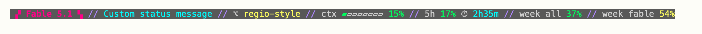

# claude-statusline

A status line for [Claude Code](https://docs.claude.com/en/docs/claude-code) that shows the
weekly usage limits, including the per-model ones (Fable, Opus, ...) that Claude Code itself
does not always pass to status line scripts.


Every percentage is coloured: green below 50%, yellow from 50%, red from 80%.
Uses ANSI colours, so it follows your terminal palette (pairs well with Claude's `light-ansi` /
`dark-ansi` themes).

## How it works

- Model, session name and context usage come from the JSON Claude Code pipes to the script.
- Weekly limits come from Anthropic's usage endpoint (`/api/oauth/usage`), the same source the
  `/usage` command and tools like claudometer use. The script reads the Claude Code OAuth token
  from the macOS keychain, caches the answer for 60 seconds and refreshes it in a background
  process, so rendering takes a few milliseconds and never waits on the network.
- Every `weekly` row the server returns is printed with the server's own label, so new
  per-model buckets show up without changes.
- If the fetch fails it keeps the last cached figures, or falls back to the overall weekly
  figure Claude Code provides.

## Install

Requires macOS, `jq` and `curl`. Claude Code must be logged in with a claude.ai account
(the token lives in the keychain under "Claude Code-credentials").

```
git clone git@github.com:fabioelizandro/claude-statusline.git ~/claude-statusline
~/claude-statusline/install.sh          # default style
~/claude-statusline/install.sh regio    # neon style, see below
```

Or set it up by hand: copy `statusline.sh` somewhere, make it executable, and add to
`~/.claude/settings.json`:

```json
{ "statusLine": { "type": "command", "command": "/path/to/statusline.sh" } }
```

## Styles

### default (`statusline.sh`)

The one pictured above: model, session, context and the weekly limits, in your terminal's
ANSI palette.

### regio (`regio.sh`)

A neon take on the same data, plus the git branch and the 5-hour window:



- Hot-pink model, cyan session, yellow branch, purple `//` separators.
- Context gets an 8-block bar next to the percentage.
- The 5-hour window shows its percentage and the time left until it resets.
- Weekly rows are the same server-labelled list as the default style.
- Percentages and the bar use the same thresholds (green < 50, yellow from 50, pink from 80).
- 256-colour ANSI on a dark-grey pill, so it looks the same on light and dark terminal themes.

## Customise

In either script, thresholds and colours are the `pct_color` function near the top. Segments
are built into `$line` near the bottom; remove or reorder them there.
